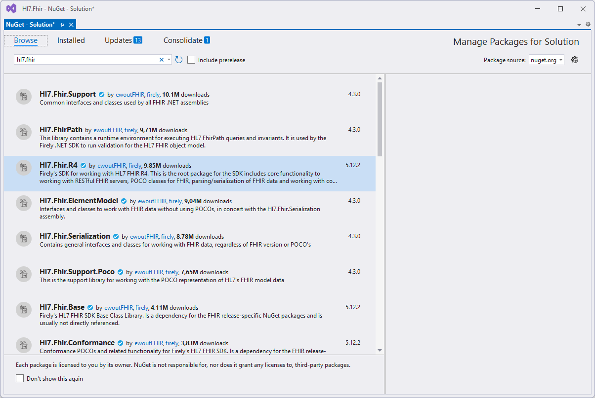

# Getting Started

As mentioned in the [introduction](introduction), you need to select the [appropriate NuGet package](https://www.nuget.org/profiles/firely) for the FHIR version you are working with.

* For most use cases, include the `Hl7.Fhir.<release>` NuGet package.
* If you require profile validation, also add the `Firely.Fhir.Validation.<release>` package.
* To enable FHIR NPM package support, include the `Firely.Fhir.Packages` package.

All other NuGet packages provided by Firely are either directly or indirectly used by these three main packages.

## Install via .nuspec

Run the following command to add the package:

```bash
dotnet add package Hl7.Fhir.R4
```

## Install via Visual Studio

To install the package using Visual Studio, follow these steps:

1. Open your project or create a new one.
2. Navigate to **Tools** 🠮 **NuGet Package Manager** 🠮 **Manage NuGet Packages for Solution...**.
3. In the **Browse** tab, type `fhir` in the search field.
4. Select the required package, such as `Hl7.Fhir.R4`.
5. Check the box next to your project name and click **Install**.


