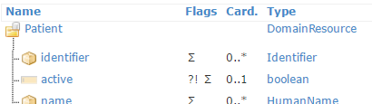
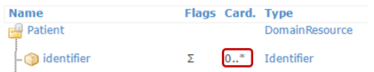
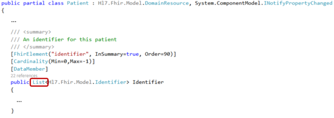

# Model Classes

For each resource type and data type in FHIR, the SDK contains a corresponding public class. These are often referred to as "POCOs" (Plain Old C# Objects) or "model classes."

Creating a new instance of any resource or data type from the FHIR specification is straightforward:

```csharp
var pat = new Patient();
var id = new Identifier();
```

```{tip}
When creating an instance of a resource or data type, refer to the
[FHIR specification](http://www.hl7.org/fhir) to identify mandatory elements for that type and understand how each element is used.
```

## Elements

The SDK classes include a property for each element in the resource or data type model. For example, the `Patient` resource has an `active` element:



The `Patient` class in the SDK has a property called `Active` that corresponds to this element:

```csharp
pat.Active = true;
```

## List Elements

Repeating elements are represented in the class as a .NET `List` of the element's type:





For example, to add the `Identifier` we created earlier to the `Identifier` property of the `Patient` instance, you can do the following:

```csharp
pat.Identifier.Add(id);
```

## Nullability

You may have noticed that you did not need to initialize the `Identifier` list property in the previous example before adding elements to it. For list properties, the SDK automatically initializes the list on first use.

However, non-list properties will be `null` by default, so you must initialize them before use.

To assist with this, the model classes are generated with [nullability annotations](https://learn.microsoft.com/en-us/dotnet/csharp/nullable-migration-strategies). This ensures the compiler warns you if you attempt to access or set a property that has not been initialized.

```{note}
Even if the FHIR specification indicates that an element is mandatory (i.e., has a cardinality greater than 0), the POCO will still allow you to set it to `null`. We have also not used the `required` keyword in C# to enforce this. This design choice allows you to create objects even if the required data is unavailable at creation time. However, exchanging incomplete data may result in non-conformant FHIR usage. Ensuring your POCOs are valid is discussed in the section on [validation](validation).
```

## Element.id and Extension.url

The FHIR specification describes two special elements: `Element.id` and `Extension.url`. While these elements are typed as normal FHIR strings in the specification, they are actually special properties that can only hold primitive values. For consistency, the model classes use the standard FHIR data types. Treat these elements as [primitive data types](#datatypes-primitives) and avoid adding extensions to them. 

Note that `Element.id` is generated as the `ElementId` property to avoid confusion with other elements named `id`.

