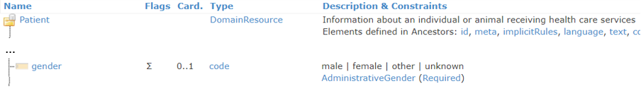

# Enumerations

FHIR makes extensive use of terminologies, with many elements represented as "codes". The allowed values for a code are defined by *valuesets*. When an element is bound to an enumerable and fixed valueset, and it cannot contain any other codes beyond those specified in that valueset (referred to in FHIR terminology as a "required" valueset), the SDK generates a .NET `enum` to represent that valueset. This approach ensures that only valid codes can be used and makes the allowed codes easily accessible through IntelliSense.

For instance, the `Patient` resource has a fixed `ValueSet` for the `gender` element.



This is translated into an enumeration in the SDK:

```{image} ../images/sdk_patient_gender.png
```

Since this code is always a primitive, you can simply assign the appropriate enum value to its "helper property":

```csharp
pat.Gender = AdministrativeGender.Male;
```

## Code&lt;T&gt;

The coded element in the POCO uses a specialized datatype, which is a subclass of `Code` called `Code<T>`. Here, `T` represents the generated enum type. Like all primitive types, both `Code` and `Code<T>` have a `Value` property. However, for `Code`, the `Value` property is of type `string`, whereas for `Code<T>`, the `Value` property is of the enum type:

```csharp
class Code
{
    ...
    public string Value { ... }
    ...
}

class Code<T> // details omitted
{
    ...
    new public T? Value { ... }

    /// <summary>
    /// The literal of the code value, taken from the enum in <see cref="Value"/>.
    /// </summary>
    public override string? Literal { ... }

    /// <summary>
    /// The system of the code value, taken from the enum in <see cref="Value"/>.
    /// </summary>
    public override string? System { ... }
}
```

This design allows you to retrieve the coded value either as a string or as the parsed enum value. However, exercise caution: if you set the `Code.Value` to a string that is not part of the enum, attempting to access `Code<T>.Value` will result in an exception.

`Code<T>` also provides direct access to the valueset's canonical url (`System`) and literal value (`Literal`). The `Literal` property contains the same value as the string representation of `Code`.
