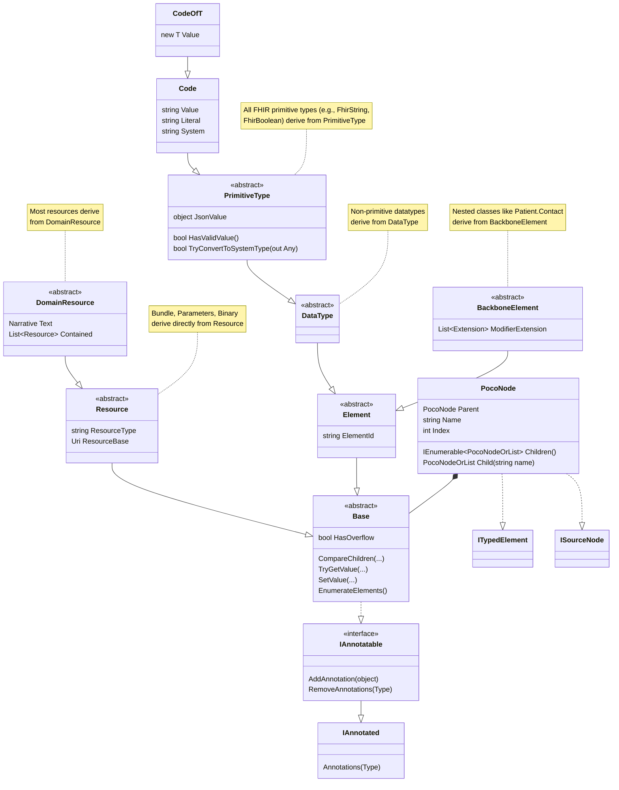
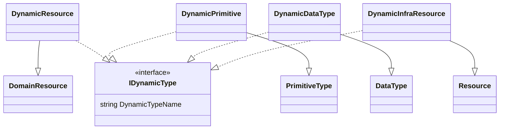
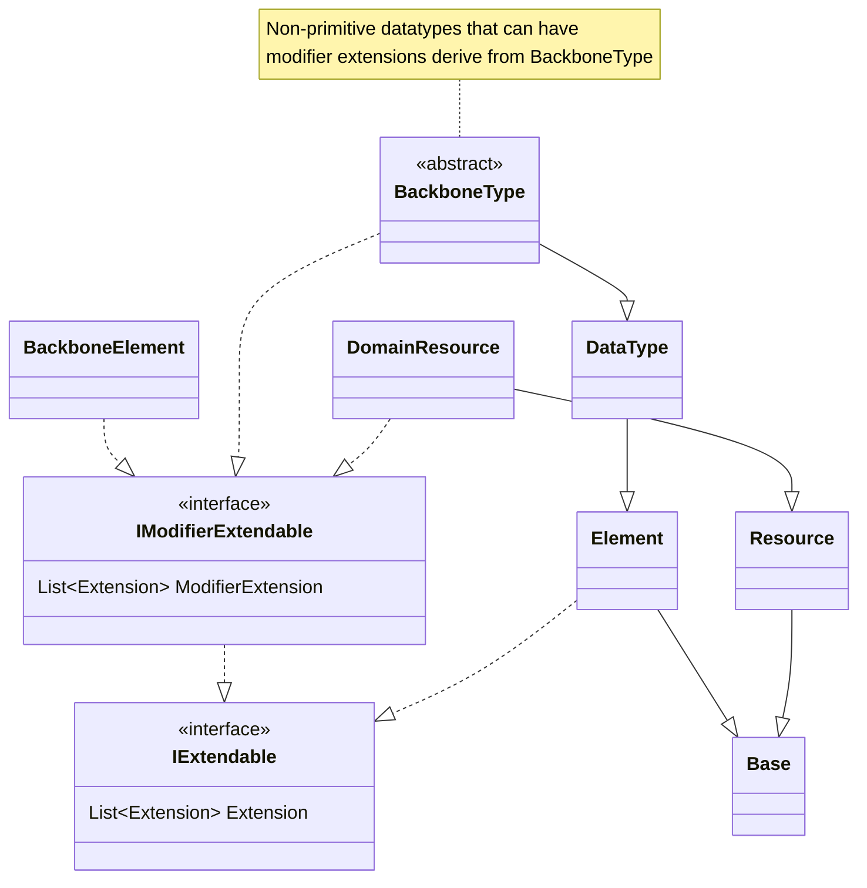

# Overview of the POCO model

The FHIR POCO (Plain Old CLR Object) model in the `Hl7.Fhir.Model` namespace maps FHIR resources and data types to idiomatic .NET classes. The UML diagram below shows the principal classes and interfaces and the relationships described in this chapter.

Historically, the class hierarchy has evolved: in FHIR STU3 and R4 most datatypes inherited directly from `Element`. R5 introduced intermediate types such as `Base`, `PrimitiveType`, and `DataType` to better structure shared behavior. The .NET SDK adopts these concepts retroactively, so the SDK POCOs for STU3 and R4 also use these base classes. As a result, the class hierarchy shown here reflects the SDK’s unified view and applies to all supported FHIR versions, even when the original STU3 and R4 definitions did not explicitly include these intermediate types.

The diagram explicitly includes `Code` and `Code<T>`: `Code<T>` is a SDK-specific construct (not part of the FHIR specification) that represents enumerable codes. The diagram also shows `PocoNode`; although this class is not part of the FHIR specification, it is important for integrating POCOs with code that uses `ITypedElement` and `ISourceNode`.

## Dynamic types in the model
The SDK also provides dynamic types for representing instances that do not have a compiled POCO in the SDK. The parsers create these runtime types when they encounter unknown resource types or data that have no corresponding .NET class.

## Modifier extensions in the model
The FHIR specification treats modifier extensions differently from regular extensions: modifier extensions convey additional information that must not change the core meaning of the element they modify, and they therefore require careful handling. The SDK indicates which classes may carry modifier extensions by using the `IModifierExtendable` interface.

As shown in the diagram, most typical FHIR resources support both `Extension` and modifier extensions, but some infrastructure resources such as `Bundle` and `Parameters` (which derive directly from `Resource`) do not support extensions at all. Also, primitive types may have regular `Extension` instances but cannot have modifier extensions.

