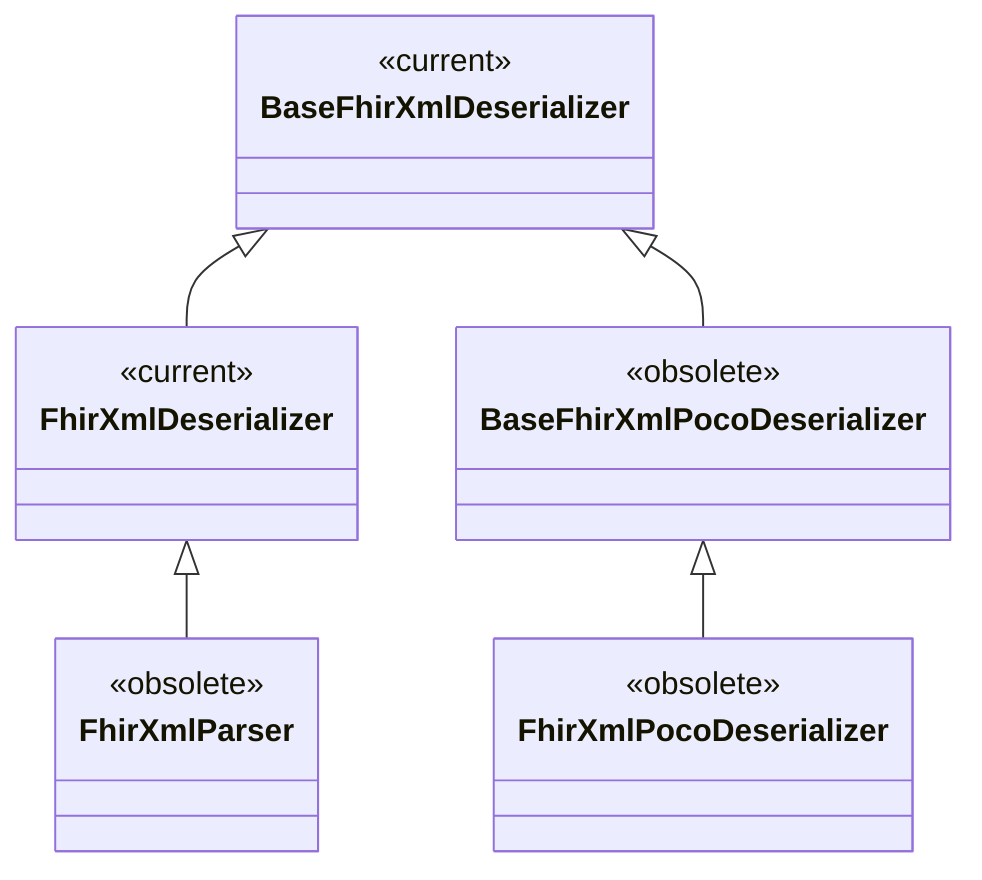
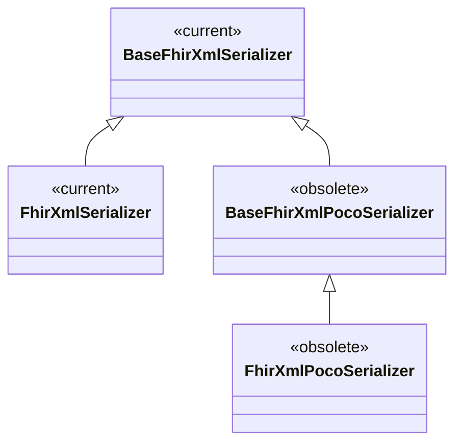

(parsing-migration)=
# Migrating from older SDK versions

The parsing classes have been renamed twice over the SDK's lifetime, so older code and tutorials use names that are now obsolete. This page maps those names onto the current API. If you are writing new code, you do not need it — start from {doc}`deserialization` and {doc}`serialization`.

Two naming changes account for almost everything:

- **"Parser" became "Deserializer".** The original `FhirXmlParser` / `FhirJsonParser` (SDK 3) are obsolete in favour of `FhirXmlDeserializer` / `FhirJsonDeserializer`.
- **The `Poco` infix was dropped.** The SDK 5 `*Poco*` classes (e.g. `BaseFhirXmlPocoDeserializer`) are obsolete; the current classes drop `Poco` from the name (`BaseFhirXmlDeserializer`).

## A short history of the classes

The diagrams below show the XML deserialization and serialization classes and how they relate. The JSON classes mirror them exactly (`FhirJsonDeserializer`, `BaseFhirJsonSerializer`, and so on).

`FhirXmlParser` dates back to SDK 3, the `*Poco*` classes to SDK 5, and the current names to SDK 6. All the obsolete classes still work — they are thin subclasses of the current ones — but new code should use the current names.

## Class name mapping

| Obsolete | Use instead |
|----------|-------------|
| `FhirXmlParser` / `FhirJsonParser` | `FhirXmlDeserializer` / `FhirJsonDeserializer` |
| `BaseFhirXmlPocoDeserializer` / `BaseFhirJsonPocoDeserializer` | `BaseFhirXmlDeserializer` / `BaseFhirJsonDeserializer` |
| `FhirXmlPocoDeserializer` / `FhirJsonPocoDeserializer` | `FhirXmlDeserializer` / `FhirJsonDeserializer` |
| `BaseFhirXmlPocoSerializer` / `BaseFhirJsonPocoSerializer` | `BaseFhirXmlSerializer` / `BaseFhirJsonSerializer` |
| `FhirXmlPocoSerializer` / `FhirJsonPocoSerializer` | `FhirXmlSerializer` / `FhirJsonSerializer` |

## Method changes

- `Parse<T>(…)` → `Deserialize<T>(…)`.
- The `…Async` methods (`ParseAsync`, `SerializeToStringAsync`, …) are gone: the current (de)serializers are synchronous. Call the synchronous method directly.

## Settings and options

| Old | Now |
|-----|-----|
| `ParserSettings { AcceptUnknownMembers, AllowUnrecognizedEnums, PermissiveParsing }` | `DeserializerSettings` with a {doc}`mode <error-handling>` (`Recoverable` / `BackwardsCompatible`); `AcceptUnknownMembers` and `AllowUnrecognizedEnums` also remain as shortcuts |
| `FhirJsonPocoDeserializerSettings` / `FhirXmlPocoDeserializerSettings` | `DeserializerSettings` (or `FhirJsonConverterOptions` for System.Text.Json) |
| `JsonSerializerOptions.ForFhir(Assembly)` | `ForFhir(ModelInspector)` |
| option to skip base64 decoding | automatic — base64 is kept as a string and decoded only when you read `.Value` |
| `DataAnnotationDeserializationValidator` | `FhirAttributeValidator` |

## The bigger picture

Beyond the renames, SDK 6 changed *how* the deserializer treats imperfect data: rather than rejecting anything that does not fit the POCO, it captures everything — using overflow for what does not fit — and reports only genuine problems. If you previously relied on `AcceptUnknownMembers` or permissive parsing to get data in, read {doc}`error-handling` to see how modes and overflow replace that.
